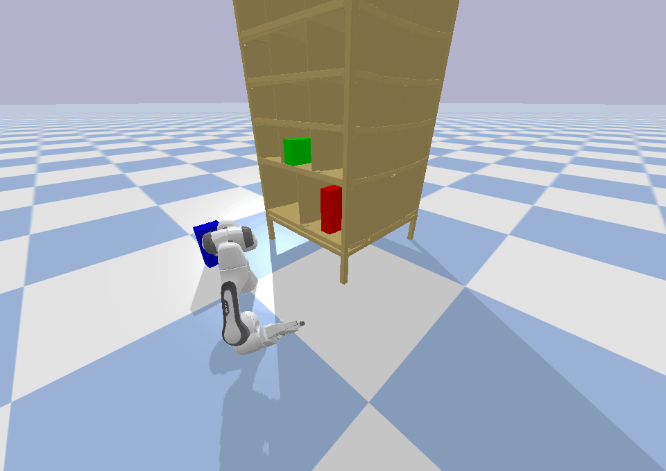
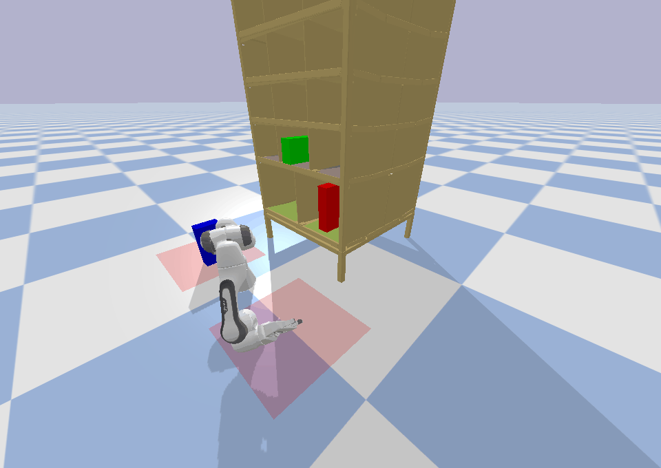

# eTAMP2

## Todo


- [ ] add target manipulation env with robot
- [ ] automate problem.pddl generation


---
## Installation

1. `git clone --recurse-submodules git@github.com:ttianyuren/eTAMP-zero.git`: to clone this repo with submodules
1. `pip install -r requirements.txt`
2. `sudo apt-get -y install cmake g++ make python3 autoconf automake`: to install dependencies for symk
3. `/symk/build.py `: to build the [symk](symk) planner

or later `git submodule update --init`


---
## Run examples

```
./etampt2.py
./play_solutions.py
```






---
## [Learn eTAMP and Symbolic Planning](onboarding.md)


## References

### Main source

1. [eTAMP](https://arxiv.org/pdf/2103.05456.pdf): a integrated task and motion planner for robot applications
2. [CP-BO](https://arxiv.org/pdf/2201.09612.pdf): to accelerate eTAMP via geometric constraint learning

### Based on

1. [symk (based on fastdownward)](https://github.com/speckdavid/symk): a top-k symbolic planner (interchangeable)

