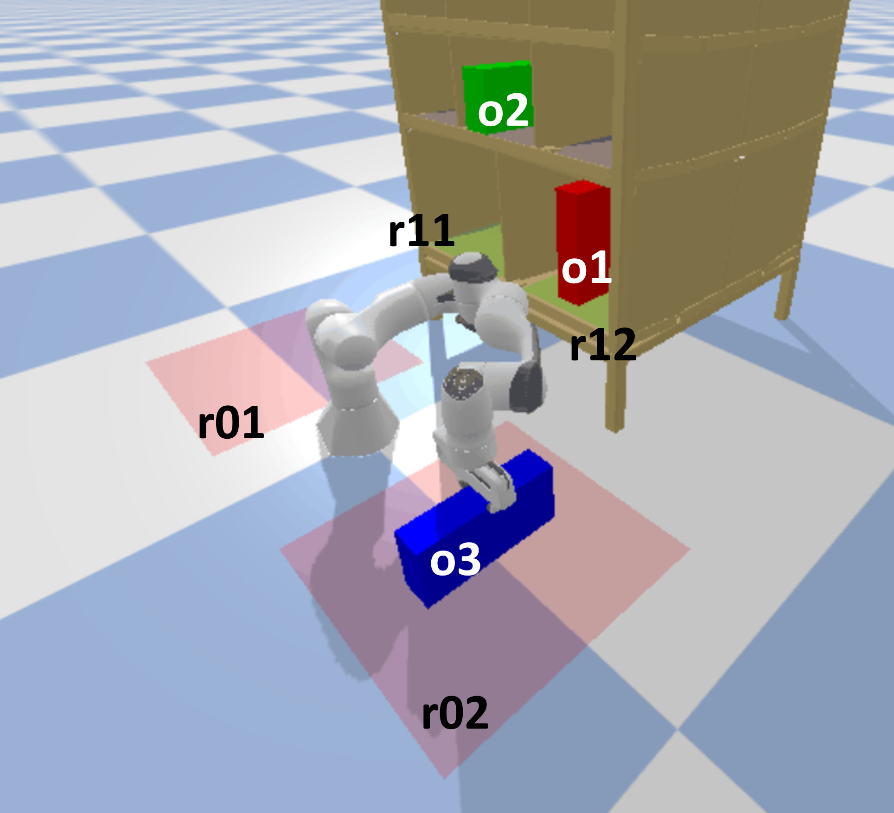

# Get Started with eTAMP and Symbolic Planning

This guide will help you get hands-on experience with the **eTAMP** (Extended Tree Search for Task and Motion Planning) algorithm and its symbolic planning backbone. eTAMP relies on the [**symk** planning algorithm](https://github.com/speckdavid/symk) to generate candidate high-level symbolic plans, which serve as a foundation for later detailed planning. In this guide, you'll explore symbolic planning using **PDDL** and see how these components interact within eTAMP.

Follow the steps below to explore symbolic planning concepts and experiment with the eTAMP environment.

---


## Step 1: Understand the Basics of Symbolic Planning

1. **Learn What Symbolic Planning Is**:
   - Symbolic planning is the process of generating a sequence of high-level actions, like "pick," "move," or "stack," to achieve a specific goal based on a set of defined rules, constraints, and relationships between objects.
   - The **Planning Domain Definition Language (PDDL)** is a standardized language for defining planning problems in symbolic AI. PDDL separates the "domain" (all possible actions and object types) from the "problem" (specific objects, initial conditions, and goals for a scenario).

   Here’s a simple example to illustrate:

   ### PDDL Example: Robot Block Stacking Problem
   Imagine a robot tasked with moving a given object (`o3`) to a specific region (`r02`). The robot can only manipulate one block at a time.

     

   - **Domain File (`domain.pddl`)**:
     ```lisp
        (define (domain pick-and-place)
        (:requirements :strips :equality :action-costs) ; Specifies required PDDL capabilities: basic strips, equality checks, and action costs
        (:types wuti grasp_dir grasp config pose trajectory) ; Defines types used in the domain (wuti for object, config for robot configuration, etc.)

        (:predicates
          (graspable ?o - wuti)        ; if object ?o can be grasped
          (attached ?o - wuti)         ; if object ?o is currently held to the robot
          (handempty)                  ; if the robot’s hand is free (not holding anything)
          (on ?o - wuti ?r - wuti)     ; if object ?o is placed on another object or location ?r
          (occupied ?r - wuti)         ; if location or object ?r is occupied by another object
        )

        (:functions
          (total-cost) - number        ; A numerical function to track the total action cost
        )

        (:action pick
          :parameters (?o - wuti)         ; The action of picking up object ?o
          :precondition (and (handempty)  ; the robot hand must be empty
                            (graspable ?o) ; Object ?o must be graspable
                            (not (attached ?o)) ; Object ?o should not already be held by the robot
                            (not (occupied ?o)) ; Object ?o should not occupy another location
                            )
          :effect (and (not (handempty))    ; the robot’s hand is no longer empty
                      (attached ?o)        ; Object ?o is now attached to the robot (held)
                      (forall (?r - wuti) (not (on ?o ?r))) ; Object ?o is removed from any location ?r
                      (increase (total-cost) 100) ; Increases the total-cost
                      )
        )

        (:action place
          :parameters (?o - wuti ?r - wuti) ; The action of placing object ?o onto location ?r
          :precondition (and (attached ?o) ; object ?o must be attached (held by the robot)
                            (not (= ?o ?r)) ; ?o and ?r must be distinct objects
                            )
          :effect (and (handempty)        ; the robot’s hand is now free
                      (not (attached ?o)) ; Object ?o is no longer held by the robot
                      (on ?o ?r)          ; Object ?o is now placed on location ?r
                      (increase (total-cost) 100) ; Increases the total-cost
                      )
        )

        (:derived (occupied ?r - wuti) ; Defines a derived predicate (logical rule)
          (exists (?o) (on ?o ?r))     ; Location ?r is occupied if there exists an object ?o on ?r
        )
      )
     ```

   - **Problem File (`problem.pddl`)**:
     ```lisp
        (define (problem put-wuti)
        (:domain pick-and-place) ; Specifies that this problem uses the "pick-and-place" domain

        (:objects
                o1 o3 r01 r02 r11 r12 - wuti ; Defines objects involved in the problem (two objects, o1 and o3, and four locations r01, r02, r11, r12)
        )

        (:init
                (graspable o1)       ; Initially, object o1 is graspable by the robot
                (graspable o3)       ; Object o3 is also graspable
                (handempty)          ; The robot's hand is empty at the start
                (on o1 r12)          ; Object o1 is located on r12 initially
                (on o3 r01)          ; Object o3 is located on r01 initially
                (= (total-cost) 0)   ; The starting total cost of actions is set to 0
        )

        (:goal
              (and (on o3 r02)) ; The goal is to place object o3 onto location r02
        )

        (:metric minimize (total-cost)) ; The planner should minimize the total cost of actions taken to reach the goal
      )
     ```

   - **Inputs of a planning task**:
     - **Domain File**: Defines the types of actions (`pick-up`, `put-down`, `stack`, and `unstack`) that the planner can use to reach the goal. Each action has **preconditions** (requirements for performing the action) and **effects** (how the state changes after the action).
     - **Problem File**: Describes the initial conditions and the goal. In this setup, all blocks (`A`, `B`, and `C`) are on the table and clear, while the goal is to have `A` stacked on `B` and `B` stacked on `C`.

   - **Example Plan Generated by a Planner**:
     Given the domain and problem files above, a symbolic planner might generate the following sequence of actions to achieve the goal:

     ```
        (pick o3)
        (place o3 r02)
     ```

2. **Watch an Introductory Tutorial**:
   - To get a deeper understanding, watch this tutorial series (first 8 episodes) on symbolic planning fundamentals: [AI Planning Video Tutorial](https://www.youtube.com/watch?v=7Vy8970q0Xc&list=PLwJ2VKmefmxpUJEGB1ff6yUZ5Zd7Gegn2).
   - This will provide a gentle introduction to planning concepts and help you understand the structure and logic of PDDL files used in eTAMP.

---
## Step 2: Understand what top-k planning is

1. **What is Top-K Planning?**
   - **Top-k** planning allows us not only to find the single best plan but also to generate a set of **k optimal plans**, each achieving the goal with the lowest cost, though possibly following different paths. This approach provides flexibility and robustness, as it allows the planning system to choose from multiple high-quality plans, which can be useful in dynamic environments where conditions may change.
   
2. **symk for top-k planning**
   - **symk** is employed as the top-k planner by eTAMP to explore various paths to reach a goal, making it more adaptable and enhancing the robustness of the planning system.

3. **Example**
     
   - **Task** The same pick-place task as before.

   - **Example of multiple plans** that a top-k planner might generate. The plans are organized in a tree view, showing different possible paths to achieve the goal. 
   
     ```
     Root
     ├── (pick o3)
     │   ├── (place o3 o1)
     │   │   └── (pick o3)
     │   │       └── (place o3 r02) (Plan length: 4)
     │   ├── (place o3 r01)
     │   │   └── (pick o3)
     │   │       └── (place o3 r02) (Plan length: 4)
     │   ├── (place o3 r11)
     │   │   └── (pick o3)
     │   │       └── (place o3 r02) (Plan length: 4)
     │   ├── (place o3 r12)
     │   │   └── (pick o3)
     │   │       └── (place o3 r02) (Plan length: 4)
     │   └── (place o3 r02) (Plan length: 2)
     └── (pick o1)
         ├── (place o1 r12)
         │   └── (pick o3)
         │       └── (place o3 r02) (Plan length: 4)
         ├── (place o1 r11)
         │   └── (pick o3)
         │       └── (place o3 r02) (Plan length: 4)
         ├── (place o1 r02)
         │   └── (pick o3)
         │       └── (place o3 r02) (Plan length: 4)
         └── (place o1 r01)
             └── (pick o3)
                 └── (place o3 r02) (Plan length: 4)
     ```

     - **Explanation of Plans**:
       - Each branch represents an alternative plan generated by SymK to achieve the goal of placing object `o3` in a specific location (`r02`). Different paths involve varying intermediate placements and actions, such as placing `o3` on various other objects or in different regions before achieving the final goal. This variety of plans allows the planner to select from multiple optimal paths depending on real-world conditions.
   
   By following these top-k plans, SymK provides a robust approach to symbolic planning, ensuring that if one path is obstructed, alternative plans are readily available.

---


## Step 3: Know what Fast Downward is

1. **Understand Fast Downward’s Role in eTAMP**:
   - **Fast Downward** is a powerful planning engine used by `symk` to explore possible symbolic plans. It’s flexible and supports a range of heuristics, though you don’t need to dive into all its details for task and motion planning (TAMP).
   - Fast Downward helps generate symbolic plan "skeletons" based on input PDDL files, which eTAMP then refines during its motion planning phase.

---


## Step 4: Know the PDDL version for eTAMP

1. **PDDL Version**:
   - **symk** and eTAMP rely on **PDDL 2.2**, which introduced important features like derived predicates, action costs, and equality. These additions allow for greater expressiveness in defining complex planning problems.
   
2. **Compatibility Note**:
   - symk only supports up to PDDL 2.2 because of its dependency on **Fast Downward** (which also supports PDDL 2.2). This means you don’t need to worry about later versions, which may have overly complex syntax and features that are not applicable in eTAMP.

---

## Step 5: Set up Your eTAMP Environment

1. **Clone the eTAMP Repository**:
   - Use this repository to start experimenting with eTAMP: [eTAMP-zero GitHub Repo](https://github.com/ttianyuren/eTAMP-zero).
   - After cloning, ensure all dependencies are installed by following any setup instructions in the repository.

2. **Locate the `symk` Script**:
   - In eTAMP, the **symk** algorithm is run through a script at [`connect_topk.py`](https://github.com/ttianyuren/eTAMP-zero/blob/main/connect_topk.py), which internally leverages **Fast Downward** to perform symbolic planning.
   - We’ll experiment with symk’s inputs (two PDDL files) to observe how changes affect the resulting symbolic plans.

---

## Step 6: Experiment with `symk` Inputs

1. **Run the `symk` Algorithm**:
   - Open the script [connect_topk.py](https://github.com/ttianyuren/eTAMP-zero/blob/5b3cf89801ef435fc4545a823dabf872dfa06747/connect_topk.py#L92).
   - Notice the PDDL file paths: `"/pddl/domain.pddl"` and `"/pddl/problem.pddl"`. These are the inputs to `symk` for generating symbolic plans.

2. **Test Different PDDL Files**:
   - Swap in different PDDL files to see how they impact the output plans. You can find example PDDL files in [this Fast Downward benchmarks folder](https://github.com/aibasel/downward/tree/main/misc/tests/benchmarks).
   - Try modifying small parts of the PDDL files, such as adding or removing actions or constraints, to see how they impact the plan structure.
   - Run the script and observe how the output plan changes with different domains and problems. This will give you a practical sense of how symbolic planners interpret and generate plans.

---


By following these steps, you'll gain practical knowledge of symbolic planning, become familiar with PDDL, and understand how eTAMP leverages symbolic plans for task and motion planning. Happy experimenting!